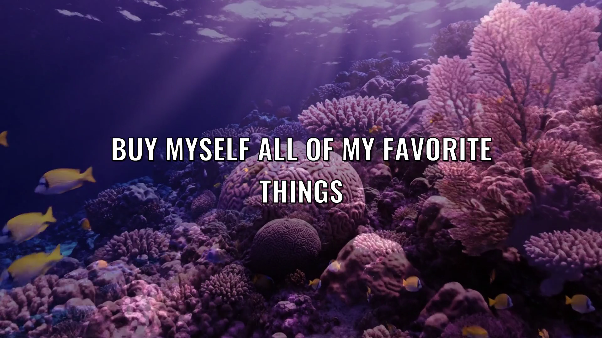
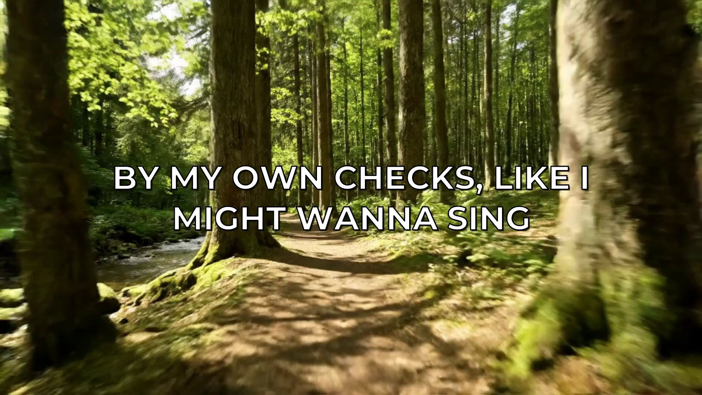
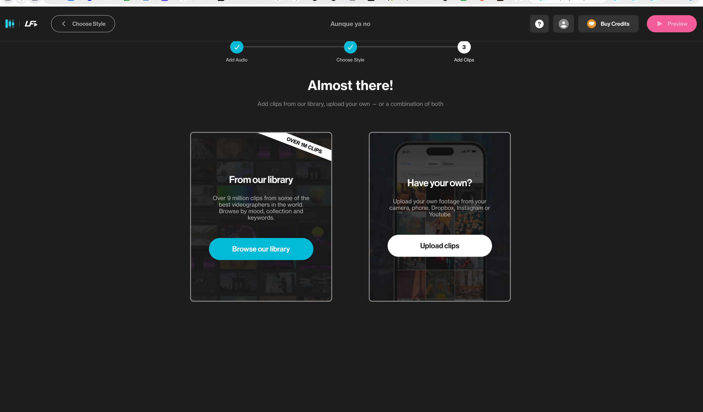
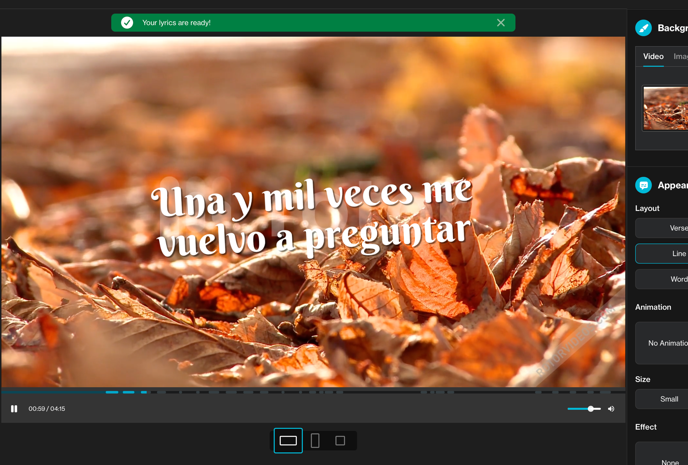
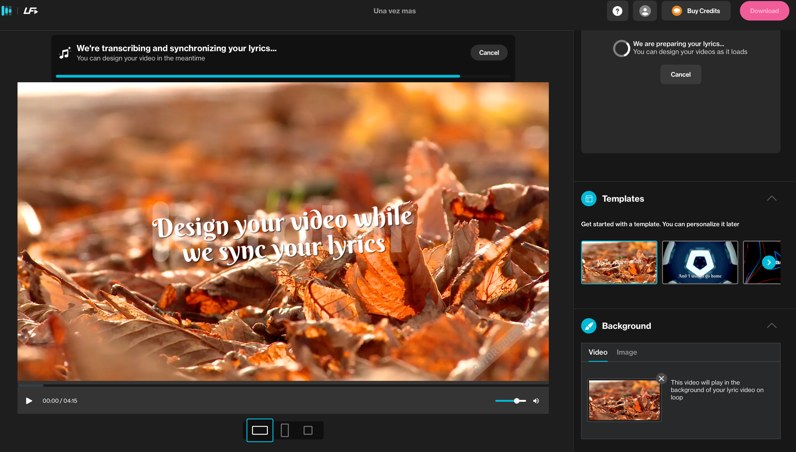
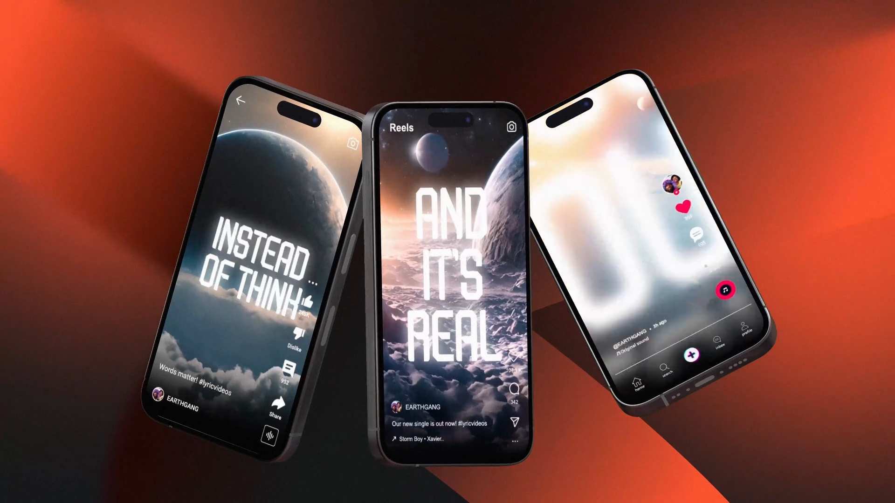

# Benchmark de fondos — GenLy vs Rotor vs Musixmatch

> Evidencia visual del diferenciador central de GenLy: **fondo generativo único por canción**
> vs **stock/template compartido** (Rotor) vs **generativo abstracto social-first** (Musixmatch/Runway).
> Frames reales: GenLy de `lyricgen/outputs/`, Rotor de dogfooding propio (track "Una vez más" en español),
> Musixmatch de sus ejemplos públicos. Fecha: 2026-05-20.

---

## GenLy AI — fondo generativo cinematográfico, full HD 16:9

Fondo único generado por IA según el mood/temática de la canción. Tipografía limpia, legible, sincronizada.
Es el video oficial terminado, sin watermark, propiedad 100% del cliente.

---

## Rotor (LyricFind) — metraje STOCK + plantilla

Mismo track en español ("Una vez más"). El fondo es **metraje stock de su librería de 9M de clips**
(hojas de otoño), igual para cualquier usuario que elija ese clip. La "personalización" es la combinación
clip + estilo + tipografía, **no material bespoke**. Watermark "rotor" hasta pagar el crédito.

Librería de clips stock (el "fondo" sale de acá, compartido entre todos los usuarios):

**Implicancia de derechos (clave para un sello):** el clip stock NO es del cliente (licencia limitada,
no exclusiva). Al ser compartido, el video puede recibir reclamos de **ContentID en YouTube/Facebook**
si otro usuario usó el mismo clip. Rotor declara que "no garantiza que el video no sea flaggeado" y que
"no interviene en disputas de ContentID". Para releases oficiales monetizados de un sello, es un riesgo real.

---

## Musixmatch / Runway — generativo abstracto, social-first

Fondo generativo (Runway) pero **abstracto/artístico** y orientado a clip social corto (30s, Canvas, Reels),
no a video oficial full-length. Buena pieza de promo, no el video oficial de YouTube.

---

## Lectura del benchmark

| Eje | **GenLy** | **Rotor** | **Musixmatch** |
|---|---|---|---|
| Origen del fondo | Generado único por canción | Stock compartido (9M librería) | Generativo abstracto (Runway) |
| Formato fuerte | Full 16:9 broadcast | Full 16:9 (stock) | Clip social 30s / Canvas |
| Propiedad del fondo | 100% del cliente | Licencia limitada (no es del cliente) | Dentro del ecosistema |
| Riesgo ContentID | Ninguno (material único) | **Sí** (clips compartidos) | n/d (clip corto) |
| Bespoke a la canción | Sí | No (recombinación de stock) | Parcial (prompt) |

**Conclusión:** el fondo único + ownership total + sin riesgo de ContentID es lo que ningún competidor
da a la vez. Rotor gana en librería y precio de entrada; nosotros ganamos en unicidad, propiedad y
seguridad de derechos para releases oficiales — exactamente lo que pesa para un sello.
